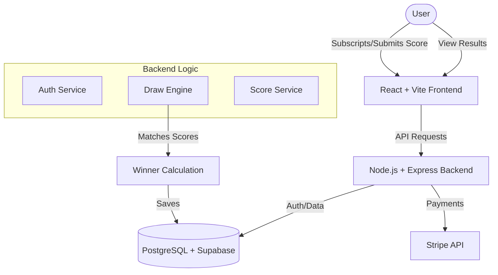

# CharityRoll - Decentralized Charity Lottery Platform

CharityRoll is a transparent, algorithmic lottery platform where 90% of subsciption fees go to a prize pool and 10% goes directly to user-selected charities. Players enter by submitting their weekend golf scores.

## 🏗️ System Architecture & Data Flow



---

## 🚀 Getting Started

### Prerequisites
- Node.js (v18+)
- PostgreSQL (or Supabase URL)
- Stripe Account (for test keys)

### Installation

1. **Clone the repository:**
   ```bash
   git clone <repo-url>
   cd Charity
   ```

2. **Frontend Setup:**
   ```bash
   cd frontend
   npm install
   ```

3. **Backend Setup:**
   ```bash
   cd ../backend
   npm install
   ```

---

## ⚙️ Environment Configuration

### Backend (`backend/.env`)
Create a `.env` file in the `backend` directory:
```env
PORT=5001
DATABASE_URL=your_postgresql_url
JWT_SECRET=your_jwt_secret
CORS_ORIGIN=http://localhost:5173
STRIPE_SECRET_KEY=sk_test_...
STRIPE_WEBHOOK_SECRET=whsec_...
NODE_ENV=development
```

### Frontend (`frontend/.env`)
Create a `.env` file in the `frontend` directory:
```env
VITE_API_URL=http://localhost:5001
```

---

## 🏃 Running the Project

1. **Start the Backend Server:**
   ```bash
   cd backend
   npm run dev
   ```
   *Server runs on http://localhost:5001*

2. **Start the Frontend App:**
   ```bash
   cd frontend
   npm run dev
   ```
   *App runs on http://localhost:5173*

---

## 🧪 Key Features
- **Subscription Model**: Automatic entry with monthly subscription.
- **Golf Score Integration**: Users submit scores which are validated against draws.
- **Transparent Drawing**: Algorithmic "Match Engine" runs on the 28th of every month.
- **Charity Voting**: 10% of every ticket goes to an NGO selected by the user.
- **Admin Dashboard**: Run draft draws, verify winners, and manage charities.
